<h1 align='center'> Quiz Música </h1>

 

 

 

  
  

Um jogo de quiz mobile, no qual o jogador deve adivinhar qual é a música a partir de um frame do Music Video (MV)

## 📃 Licença

##  🛠️ Tecnologias

 - Framework Ionic (7.0.5) — Ionic CLI ver. 7.0.1
 - Angular ver. 16.0.0 — Angular Toolkit (9.0.0)
 - npm versão 9.5.1

## 🎯  Objetivo/Finalidade

Este quiz foi feito com o intuito de apresentar o que aprendemos com o framework Ionic como uma prova/avaliação. Escolhemos o tema de música para fazer o jogo.

## 🕹 Como jogar
Este jogo se baseia em você saber qual é a música a partir de um frame tirado do MV (*Music Video*; Videoclipe) do vídeo oficial —ou então do cenário, como na 4ª pergunta.

## 👨🏾‍💻 Como executar na sua máquina?
1. Com o npm e o ionic instalados, abra no terminal e mude para o diretório do repositório
2. Se preferir já abrir e editar diretamente no VS Code, use o comando `code .`.
3. E agora é só dar o comando `ionic serve` e pronto!

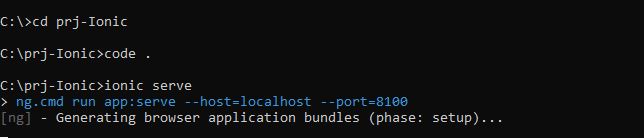

*exemplo com o aplicativo chamando `prj-Ionic`*

## 🖼️📱 Prints

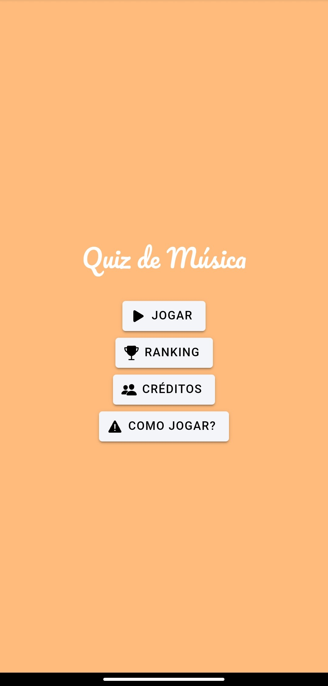
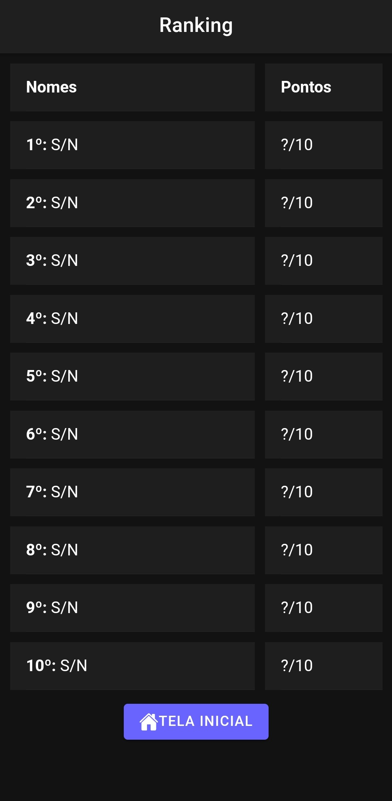
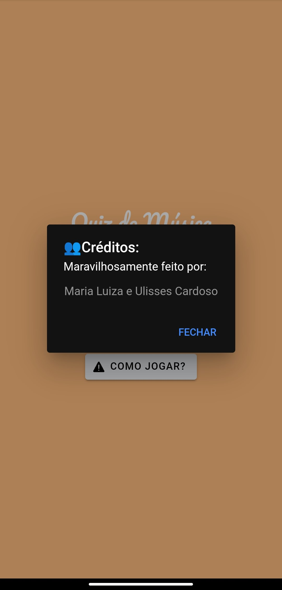
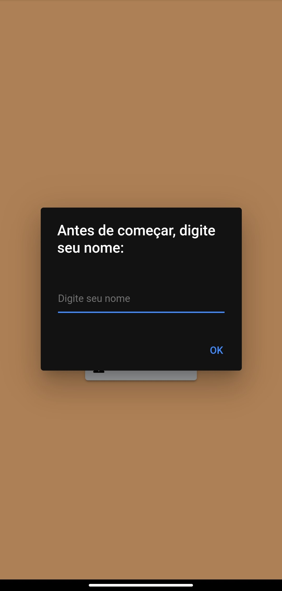
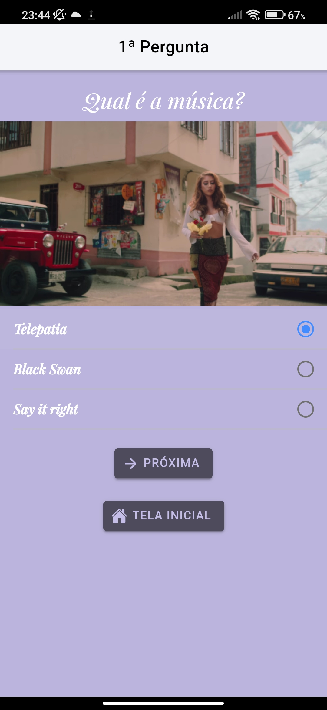
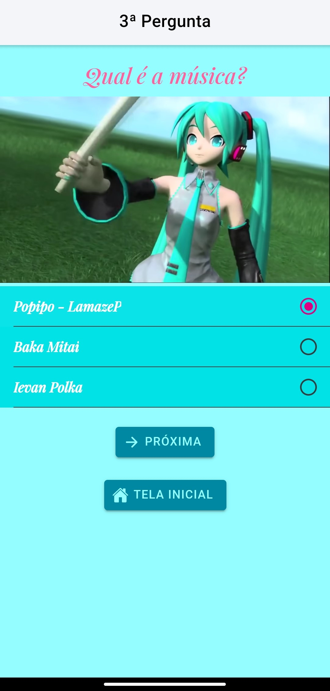
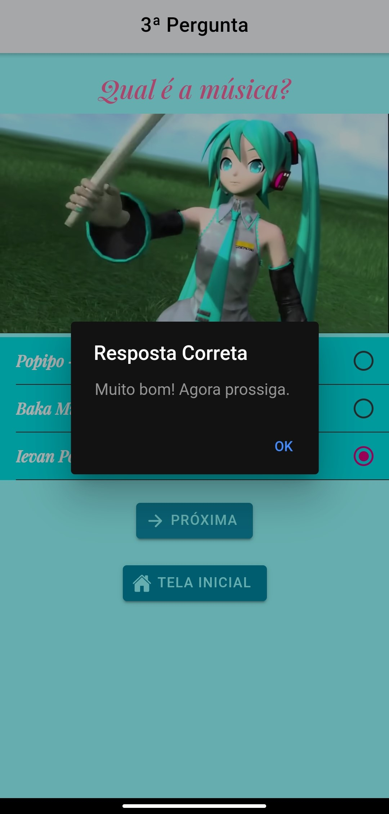
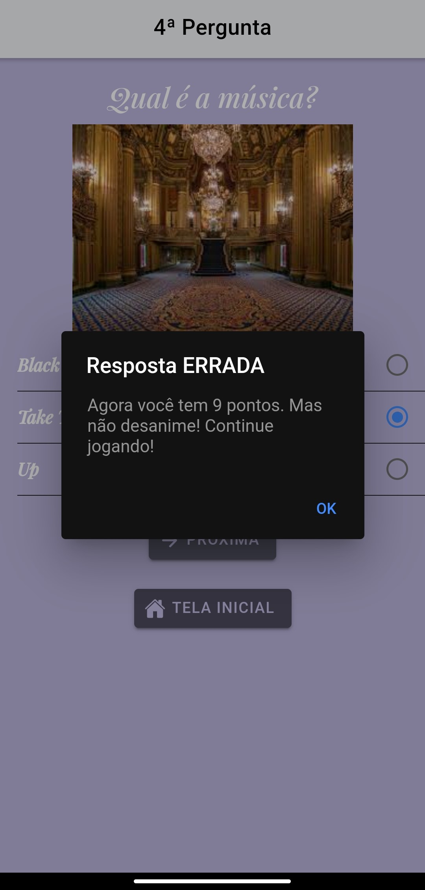
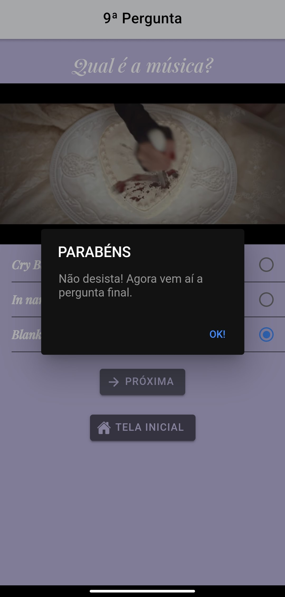
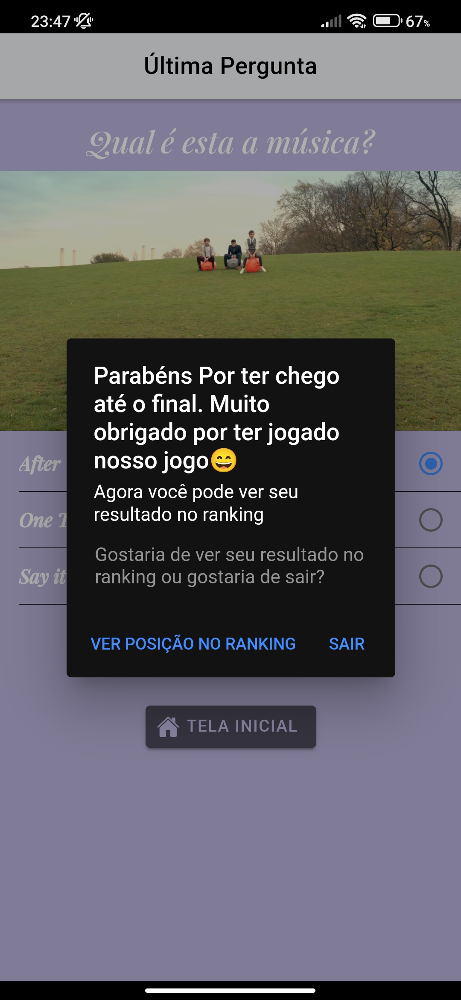
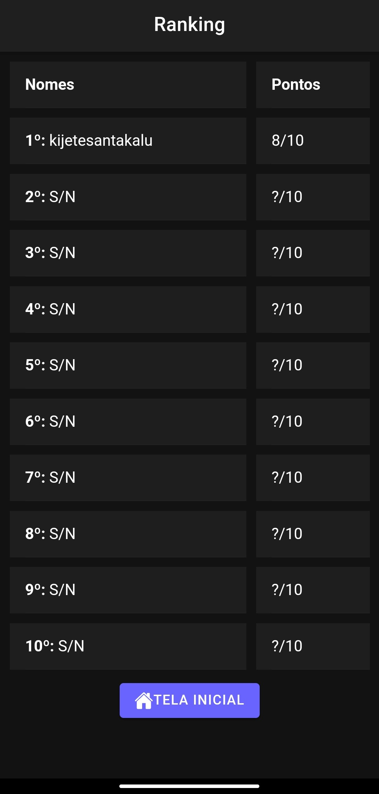
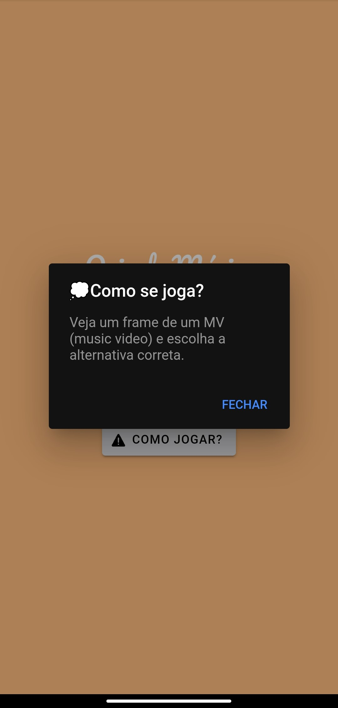
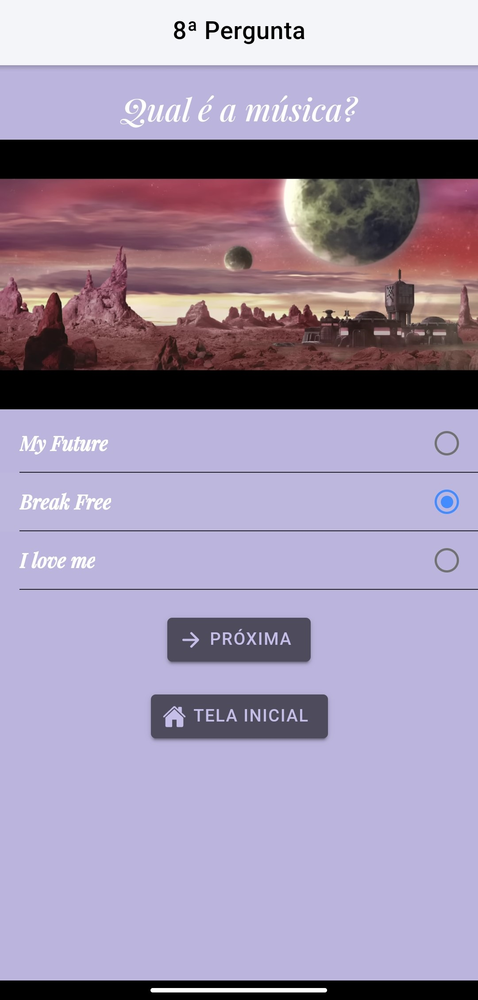

## 💝 Agradecimentos
Este é mais um projeto feito para a ETEC Aristóteles Ferreira entregue como avaliação/prova. Gosto muito desse projeto, infelizmente não está com todas as fases mas ele está com um código organizado e limpo!
Minha amiga *Malu* (Maria Luiza) que esteve comigo no projeto 🫶🏽	

## 👥 Créditos

#### Músicas usadas para as perguntas (na ordem do quiz):
1. After the Storm - Kali Uchis    
2. Telepatia - Kali Uchis
3. Ievan Polkka (cover) - Otomania ft.Hatsune Miku  
4. Black Swan - BTS ([Fonte da imagem](https://encrypted-tbn0.gstatic.com/images?q=tbn:ANd9GcR0c0sNU9EcHCILYsMzwnKAu6Zdqv8qDOLtAeC4axwT5oXwNodaKFciD5V7uro543G9oB8&usqp=CAU))
5. Why'd You Only Call Me When You're High? - Arctic Monkeys
6. Is There Someone Else? - The Weekend
7. Young and Beautiful - Lana Del Rey 
8. Break Free - Ariana Grande
9. Blank Space - Taylor Swift
10. One Direction - One Thing

